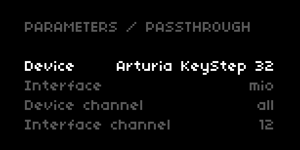
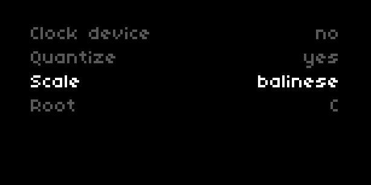

# passthrough

passthrough is intended as a simple solution for routing midi between external devices connected to norns. it may be considered midi thru for norns, defined at a script level, with a few extra functionalities added. 





## introduction

with passthrough, norns can be used as a midi routing hub. the internal nomenclature of the library defines two midi ports as either `device` or `interface`.

a `device` is conventionally dedicated to controlling, for example, a midi keyboard, sending note or control change data. an `interface`, often a device that generates sound, receives this incoming data and does something with it such as play incoming notes. 

it is possible to send midi clock messages to the `device` from the `interface`. one peculiar feature of passthrough, that extends a typical midi thru functionality is that incoming notes from the `device` can be quantized to a scale if desired.   

## use cases

- send notes through norns from a usb midi controller to a midi-compatible synthesizer. 

- scale quantization of incoming midi note data from controllers

- by leveraging callbacks at a script level, incoming midi events can be shared between norns engines/parameters and external hardware

## requirements

norns + midi compatible hardware. 

if your hardware does not offer midi via usb, an interface such as an iConnectivity mio helps to connect with 5-pin midi ports.

## installation

passthrough is intended to be easy to get up and running, and can be installed and used in two ways - *standalone* or *embedded*.

installing *standalone* has the advantage of being possible to use passthrough with various scripts, whereas *embedded* places it within a single script, making that script more portable for sharing.

the installation has been successful if `passthrough` appears in the script's params menu.  


### standalone
as a standalone script and library, it is available to download from maiden's project manager or by running the following command in maiden's repl: 
```
;install https://github.com/nattog/passthrough
```

passthrough can be used with the example scripts or by attaching it to external scripts, by adding the following code at the head of the script file:

```
if util.file_exists(_path.code.."passthrough") then
  local passthru = include 'passthrough/lib/passthrough'
  passthru.init()
end
```

### embedded

passthrough can be added to a specific script by copying [this file](https://github.com/nattog/passthrough/blob/main/lib/passthrough.lua) to the `lib` directory of a script. If `lib` does not exist, it will need to be created. the final path should look like `[script_name]/lib/passthrough.lua`.

then add the following code to the main script file:

```
local passthru = include ("lib/passthrough")
passthru.init()
```

## usage

passthrough needs a small amount of plumbing to ensure that midi is routed to the correct destination. 

### params

ensure first that you have your midi hardware connected to norns. navigate to the passthrough section in the params menu and select your `device` and `interface`. 

next, ensure that the `device channel` and `interface channel` options are correctly set. by default, these do not change the midi channel used so if your `device` is sending data on midi channel 1, the `interface` will receive data on channel 1. 

at this point, the core functionality is setup for midi data being passed from `device` to `interface`. 

`cc msg direction` toggles between unidirectional and bidirectional. unidirectional is `device` to `interface`, whereas bidirectional allows the `interface` to send control change to the `device`.

`clock device` allows the `device` to follow the clock events of the `interface`, which is useful if the `device` has an arpeggiator or sequencer functionality. 

`quantize` toggles note quantization. this allows note data to be restricted to scales. `root` and `scale` control the transposition and scale type respectively.    

### user event handling 

scripts can listen for midi events handled in passthrough and define their callbacks. The following example updates a script's `freq` and `amp` parameters based on midi device events 

```
  -- Midi event, fires when Midi data receieved
  function midi_device_event(data)
    local msg = midi.to_msg(data)

    if msg.type == "note_on" then
      hz = music_util.note_num_to_freq(msg.note)

      params:set("freq", hz)
      params:set("amp", (msg.vel / 127) * 100)
    end
  end

  passthru.user_device_event = midi_device_event
```

## issues

raise any issues experienced with passthrough either in the thread on [lines](https://llllllll.co/t/passthrough/31156) or by logging a new issue on the [github repo](https://www.github.com/nattog/passthrough/issues).

## contributing

interested in adding a new feature or making changes? any pr is always welcome.
