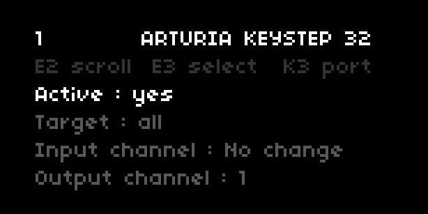

# passthrough

passthrough offers midi routing between connected ports on norns. it is similar to _midi thru_ on hardware devices although it comes with some extra functionality.



## introduction

passthrough extends norns to act as a midi routing hub. each incoming data to a port can be assigned to either a specific port for output, or all ports. it allows the user to send midi while simultaneously running a norns script.

passthrough is built as a mod and also as a library that can be added to individual scripts. they are functionally the same, but the mod version runs at all times, during scripts or when no script is loaded. If the mod is installed and turned on in the mods menu, passthrough will be running.

## use cases

- send notes through norns from a usb midi controller to a midi-compatible synthesizer. 

- scale quantization of incoming midi note data from controllers

- routing an external clock source through norns between devices

- by leveraging callbacks at a script level, incoming midi events can be shared between norns scripts and external hardware

## requirements

norns + midi devices

if your midi hardware does not offer midi via usb, a midi interface such as an iConnectivity mio helps to connect with 5-pin midi ports.

## installation

passthrough is available from the maiden catalogue or by running the following command in the maiden repl
`;install https://github.com/nattog/passthrough`

## getting started

passthrough assigns some midi routing settings for each connected midi device in the norns system menu found at `SYSTEM > DEVICES > MIDI` :
- `Target` may be all connected devices, or individual ones. this is the destination of incoming midi data 
- `Input channel` selects which midi channel is listened to for incoming midi data
- `Output channel` changes outgoing midi data to a specific midi channel, or leaves unchanged
- `Clock out` allows/prevents clock messages being output
- `Quantize midi` wraps note data to scales (quantization is set per connected midi device, so different scales can be used if desired)
- `Root` sets the root note of the current scale
- `Scale` sets the scale type (Major, Minor.. )

additionally, `Midi panic` is a toggle to stop all active notes if some notes are hanging.

there are two example scripts, showing how to interact with passthrough either as a mod or a library. they detail how to include it in scripts so that users can define callbacks on incoming midi data. 
### mod

navigate to the mod menu at `SYSTEM > MODS`, scroll to `PASSTHROUGH` and turn encoder 3 until a `+` symbol appears. restart norns and passthrough is running. when norns is shutdown, the current state of passthrough is saved. When norns is next powered on, this state will be recalled.

navigate back to the mod menu and this time there will be a `>` symbol to the right of PASSTHROUGH. press `key 3` and the screen should display the passthrough mod menu

#### mod menu controls
- `key 2` returns to `SYSTEM > MODS`
- `key 3` changes which midi device is being edited
- `enc 2` scrolls the menu to access parameters for the current midi device
- `enc 3` changes the value of the selected parameter

### library

passthrough can be used with the example scripts or by attaching it to external scripts, by adding the following code at the head of the script file:

```
if util.file_exists(_path.code.."passthrough") then
  local passthrough = include 'passthrough/lib/passthrough'
  passthrough.init()
end
```

the installation has been successful if `PASSTHROUGH` appears in the script's params menu.

### user event handling 

scripts can listen for midi events handled in passthrough and define their callbacks.

```
  -- script-level callbacks for midi event
  -- data is your midi, origin lets you know where it comes from
  function user_midi_event(data, origin)
      local msg = midi.to_msg(data)
      if msg.type ~= 'clock' then
        print(origin.port .. ' ' .. origin.name .. ' ' .. msg.type)
      end
  end

  passthrough.user_event = user_midi_event
```

## issues

raise any issues experienced with passthrough either in the thread on [lines](https://llllllll.co/t/passthrough/31156) or by logging a new issue on the [github repo](https://www.github.com/nattog/passthrough/issues).

## contributing

wishing to contribute a new feature or change? github pull requests are welcome.

## version history

for older versions, check the [releases](https://github.com/nattog/passthrough/releases) in the repo. releases older than v2.0.0 are legacy, and no longer supported for development

